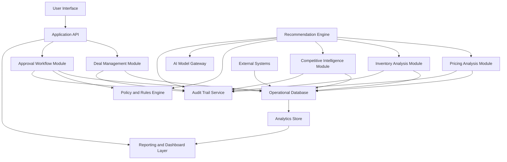

# Architecture

## Overview

Commercial Deal Desk Copilot should be designed as a modular application with clear boundaries between workflow, analysis, AI recommendations, audit logging, and reporting. The MVP can begin as a single deployable application with modular internal services, while preserving a path toward independent services as scale and integration complexity grow.

## Architectural Goals

- Provide a reliable end-to-end deal approval workflow.
- Keep business rules explainable and configurable.
- Separate deterministic policy checks from AI-generated reasoning.
- Preserve a complete audit trail for user actions, system analysis, and AI outputs.
- Support future integrations with CRM, CPQ, ERP, inventory, market intelligence, and identity providers.
- Support dashboards without overloading transactional workflows.

## Logical Architecture

## MVP Deployment Shape

The MVP can be implemented as a modular monolith:

- Single web application.
- Single application API.
- Single relational operational database.
- Background job processor for analysis, recommendation generation, notifications, and dashboard aggregation.
- AI model gateway abstraction for recommendation and summarization calls.
- Analytics tables or materialized views for dashboards.

This keeps development efficient while maintaining clear module boundaries.

## Future Deployment Shape

As usage grows, the following components could become independent services:

- Workflow service.
- Recommendation service.
- Audit service.
- Integration service.
- Analytics and reporting service.
- Notification service.

## Core Components

### User Interface

Primary surfaces:

- Deal submission form.
- Deal detail and review workspace.
- Approver queue.
- Recommendation panel.
- Pricing analysis panel.
- Inventory risk panel.
- Competitive intelligence panel.
- Audit timeline.
- Executive dashboards.

The UI should prioritize fast scanning, clear decision context, and low-friction review.

### Application API

Responsibilities:

- Authenticate requests.
- Enforce authorization.
- Expose deal, workflow, analysis, recommendation, and dashboard endpoints.
- Validate inputs.
- Coordinate transactions.
- Return audit-safe data views based on role.

### Deal Management Module

Responsibilities:

- Create and update deal records.
- Manage deal line items.
- Track deal status.
- Store customer, opportunity, pricing, and commercial term data.
- Trigger analysis when deal data changes or is submitted.

### Pricing Analysis Module

Responsibilities:

- Calculate discount, revenue, margin, and policy variance.
- Compare against historical deal benchmarks.
- Identify pricing exceptions.
- Create structured pricing analysis outputs.

### Inventory Analysis Module

Responsibilities:

- Evaluate inventory availability and projected fulfillment risk.
- Consider reservations, supply forecasts, lead times, and allocation rules.
- Produce line-level and deal-level inventory risk summaries.

### Competitive Intelligence Module

Responsibilities:

- Store and retrieve competitor signals.
- Summarize relevant account, product, region, and win/loss information.
- Provide source-linked context to the recommendation engine.

### Policy and Rules Engine

Responsibilities:

- Evaluate deterministic approval rules.
- Determine required approver roles.
- Identify hard stops and exception conditions.
- Provide explainable rule outputs to workflow and recommendation modules.

Example policy dimensions:

- Deal value.
- Discount percentage.
- Gross margin.
- Customer segment.
- Region.
- Product line.
- Inventory risk.
- Payment terms.
- Contract duration.
- Strategic account flag.

### Recommendation Engine

Responsibilities:

- Combine structured analysis and policy outputs.
- Generate recommendation action, confidence, rationale, risk flags, and suggested conditions.
- Preserve source references and model metadata.
- Support feedback capture from approvers.

The recommendation engine should use deterministic policy outputs as constraints and AI-generated text for synthesis and explanation.

### Approval Workflow Module

Responsibilities:

- Create approval plans.
- Manage sequential and parallel approval steps.
- Assign approvers by role, region, team, or policy.
- Track status, comments, escalations, decisions, and requested changes.
- Trigger notifications.

### Audit Trail Service

Responsibilities:

- Record immutable events.
- Capture actor, action, timestamp, entity, source, and before/after values when relevant.
- Capture AI model metadata, prompt/template version, and source references.
- Support export and review.

### Reporting and Dashboard Layer

Responsibilities:

- Aggregate workflow and commercial metrics.
- Support filtering and drill-down.
- Provide executive and operational views.
- Track trends over time.

## Data Architecture

### Operational Database

Stores normalized records for deals, users, roles, policies, approvals, analysis outputs, recommendations, and audit events.

Recommended MVP choice:

- Relational database.
- Strong transactional consistency for deal state and approvals.
- JSON-capable columns for flexible AI analysis payloads where appropriate.

### Analytics Store

For MVP, analytics can be built from database views, materialized views, or summary tables.

Future phases may introduce:

- Dedicated warehouse.
- Event streaming.
- BI semantic layer.
- Metric definitions service.

## AI Architecture

### AI Model Gateway

The AI model gateway isolates application modules from direct model-provider implementation details.

Responsibilities:

- Standardize prompts and model calls.
- Enforce permission-aware context construction.
- Log model, prompt, and template versions.
- Apply output validation.
- Support retries and fallback behavior.
- Redact or limit sensitive context where required.

### AI Use Cases

- Pricing rationale summarization.
- Competitive intelligence summarization.
- Deal risk synthesis.
- Recommendation explanation.
- Executive summary generation.
- Reviewer comment summarization.

### AI Guardrails

- Use structured inputs wherever possible.
- Require deterministic rules for approval authority.
- Validate AI output against an expected schema.
- Store source references with outputs.
- Clearly distinguish rule-based findings from AI inference.
- Do not permit AI to directly approve or reject deals without human action.

## Integration Architecture

### MVP

Use seeded demo datasets and manually entered deals.

### Future Integrations

Potential systems:

- CRM for accounts, opportunities, contacts, and sales stages.
- CPQ for quotes, product bundles, price books, and approvals.
- ERP for orders, invoices, customer status, and credit checks.
- Inventory management for availability and allocation.
- Data warehouse for historical deals and executive reporting.
- Market intelligence tools for competitor signals.
- Identity provider for single sign-on and role management.
- Messaging tools for notifications.

## Security Architecture

### Authentication

MVP can use application-managed users or mock identity. Future phases should support SSO through an identity provider.

### Authorization

Authorization should be role-based with optional scoped access by region, team, customer segment, and assigned workflow step.

### Data Protection

- Restrict access to sensitive margin and pricing data.
- Avoid exposing hidden financial calculations to unauthorized users.
- Log access to sensitive deal records where required.
- Ensure AI context respects the same authorization boundaries as the application.

## Event and Audit Flow

Important events:

- Deal created.
- Deal edited.
- Deal submitted.
- Analysis run started.
- Analysis run completed.
- Recommendation generated.
- Approval plan created.
- Comment added.
- Change requested.
- Deal approved.
- Deal rejected.
- Deal escalated.
- Deal withdrawn.
- Dashboard aggregate refreshed.

Every event should include enough metadata to reconstruct what happened and why.

## Reliability Requirements

- Deal submission and approval decisions must be transactional.
- Audit events should be written reliably with critical state changes.
- AI failures should not corrupt deal state.
- Analysis can be retried safely.
- Users should see stale or failed analysis status clearly.

## Observability

Track:

- Analysis job latency.
- Recommendation generation success and failure rates.
- Approval step aging.
- API errors.
- Dashboard refresh status.
- AI output validation failures.
- Audit write failures.

## Architecture Decisions for MVP

- Use a modular monolith.
- Use a relational database.
- Use background jobs for analysis and AI generation.
- Use seeded demo data instead of live integrations.
- Use deterministic rules for approval routing.
- Use AI for synthesis, explanation, and recommendation narrative.
- Store all recommendation and analysis outputs for auditability.

