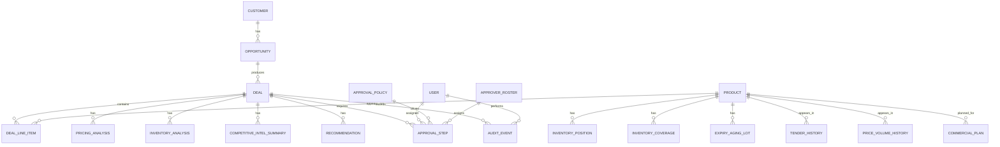

# Data Model

## Overview

The data model should support deal intake, line-item pricing, inventory analysis, competitive intelligence, recommendation generation, approval workflow, audit trail, and executive reporting.

This document describes the conceptual and logical data model. It is intentionally implementation-neutral and does not prescribe database syntax.

## Core Entities

## Entity Definitions

### User

Represents an application user.

Key fields:

- User ID
- Name
- Email
- Department
- Region
- Manager ID
- Active status
- Created timestamp
- Updated timestamp

Relationships:

- Has one or more roles.
- May submit deals.
- May approve assigned workflow steps.
- May generate audit events.

### Role

Represents a permission or workflow role.

Example roles:

- Sales Representative
- Sales Manager
- Pricing Analyst
- Finance Approver
- Operations Reviewer
- Legal Reviewer
- Executive
- Administrator

Key fields:

- Role ID
- Role name
- Description
- Permission set

### User Role

Associates users with roles.

Key fields:

- User role ID
- User ID
- Role ID
- Scope type
- Scope value

Example scopes:

- Global
- Region
- Sales team
- Product line
- Customer segment

### Customer

Represents the buying organization.

Key fields:

- Customer ID
- Customer name
- Segment
- Industry
- Region
- Strategic account flag
- Credit status
- Annual revenue potential
- Account owner ID
- Created timestamp
- Updated timestamp

### Opportunity

Represents a sales opportunity that may produce one or more deal requests.

Key fields:

- Opportunity ID
- Customer ID
- Opportunity name
- Sales stage
- Expected close date
- Forecast category
- Opportunity value
- Owner ID
- CRM reference ID
- Created timestamp
- Updated timestamp

### Deal

Represents a commercial deal approval request.

Key fields:

- Deal ID
- Deal number
- Opportunity ID
- Customer ID
- Submitted by user ID
- Deal title
- Status
- Deal type
- Region
- Customer segment
- Requested effective date
- Target close date
- Contract duration months
- Payment terms
- Included in latest financial plan
- Strategic rationale
- Total list price
- Total proposed price
- Total discount amount
- Total discount percent
- Estimated gross margin percent
- Overall risk rating
- Current recommendation ID
- Current approval step ID
- Created timestamp
- Submitted timestamp
- Updated timestamp

Example statuses:

- Draft
- Submitted
- In Analysis
- Pending Approval
- Changes Requested
- Escalated
- Approved
- Rejected
- Withdrawn
- Expired

### Deal Line Item

Represents an individual product or service included in a deal.

Key fields:

- Deal line item ID
- Deal ID
- Product ID
- Quantity
- Unit list price
- Proposed unit price
- Discount percent
- Extended list price
- Extended proposed price
- Estimated unit cost
- Estimated gross margin amount
- Estimated gross margin percent
- Requested delivery date
- Line status
- Notes

### Product

Represents an item available for sale.

Key fields:

- Product ID
- SKU
- Product name
- Product family
- Product line
- Category
- Standard list price
- Standard cost
- Margin target percent
- Active status
- Lead time days
- Inventory tracked flag

### Price Book

Represents pricing by market, customer segment, product, or effective date.

Key fields:

- Price book ID
- Name
- Region
- Segment
- Currency
- Effective start date
- Effective end date
- Active status

### Price Book Entry

Represents a product price in a price book.

Key fields:

- Price book entry ID
- Price book ID
- Product ID
- List price
- Floor price
- Target margin percent
- Currency
- Effective start date
- Effective end date

### Inventory Position

Represents inventory availability and constraints for a product.

Key fields:

- Inventory position ID
- Product ID
- Location
- Region
- On hand quantity
- Reserved quantity
- Available quantity
- Backordered quantity
- Forecast supply quantity
- Forecast supply date
- Allocation restricted flag
- Last refreshed timestamp

### Commercial Plan

Represents the approved or working commercial baseline used to compare requested deal pricing and volume against plan.

Key fields:

- Plan ID
- Plan year
- Plan period
- Region
- Country
- Channel
- Segment
- Product ID or SKU
- Product name
- Therapeutic area
- Plan units
- Plan WAC or list price
- Planned discount percent
- Planned net price
- Planned net revenue
- Standard cost
- Planned margin percent
- Plan owner
- Plan status

Supports:

- Price request versus plan analysis.
- Discount variance analysis.
- Net price variance analysis.
- Revenue and margin variance analysis.
- Channel and segment plan comparison.

Financial-plan logic:

- A deal with `Included_In_Latest_Financial_Plan = Yes` should be evaluated against commercial plan rows.
- A deal with `Included_In_Latest_Financial_Plan = No` should be classified as an incremental opportunity and benchmarked against historical price-volume records instead of plan variance.
- The field should be stored on the deal header and may be repeated in deal summary outputs for reporting convenience.

Demo source:

- `demo-data/Commercial_Plan.xlsx`

### Price-Volume History

Represents historical requested and approved commercial outcomes at customer, product, period, and channel level.

Key fields:

- History ID
- Period
- Region
- Country
- Customer
- Channel
- Product ID or SKU
- Product name
- Therapeutic area
- Requested units
- Approved units
- WAC or list price
- Requested net price
- Requested discount percent
- Approved net price
- Approved discount percent
- Approved revenue
- Outcome
- Commercial driver

Supports:

- Price-volume analysis.
- Historical benchmark analysis.
- Deal comparables.
- Discount elasticity review.
- Requested versus approved price and volume review.
- Incremental opportunity benchmarking when a deal is not included in the latest financial plan.

Demo source:

- `demo-data/Price_Volume_History.xlsx`

### Inventory Coverage

Represents demand-backed inventory availability by product, region, and location.

Key fields:

- Coverage ID
- Snapshot date
- Region
- Location
- Product ID or SKU
- Product name
- Therapeutic area
- Storage
- On hand quantity
- Reserved quantity
- Available quantity
- Open orders quantity
- Average monthly demand
- Coverage days
- Lead time days
- Coverage status
- Allocation note

Supports:

- Inventory coverage analysis.
- Supply risk screening.
- Lead-time feasibility checks.
- Allocation review.
- Deal fulfillment risk analysis.

Demo source:

- `demo-data/Inventory_Coverage.xlsx`

### Expiry Aging Lot

Represents lot-level inventory aging and expiry exposure.

Key fields:

- Lot ID
- Product ID or SKU
- Product name
- Therapeutic area
- Region
- Location
- Manufacture date
- Expiry date
- Days to expiry
- Expiry bucket
- Quantity on hand
- Inventory value
- Storage
- Quality status
- Disposition recommendation

Supports:

- Expiry and aging analysis.
- FEFO prioritization.
- Near-expiry tender allocation.
- Inventory write-off risk review.
- Redistribution recommendations.

Demo source:

- `demo-data/Expiry_Aging.xlsx`

### Tender History

Represents public, GPO, payer, hospital, and distributor tender outcomes used for competitive and pricing context.

Key fields:

- Tender ID
- Tender date
- Region
- Country
- Tendering account
- Tender type
- Product ID or SKU
- Product name
- Therapeutic area
- Status
- Tender value
- Tender units
- WAC or list price
- Winning net price
- Winning discount percent
- Primary competitor
- Outcome
- Loss or win driver
- Contract term

Supports:

- Tender competitive intelligence.
- Win/loss review.
- Tender price benchmarking.
- Competitive pressure scoring.
- Approval rationale for public and institutional deals.

Demo source:

- `demo-data/Tender_History.xlsx`

### Competitive Intelligence Record

Represents raw or curated competitor context.

Key fields:

- Competitive intel ID
- Customer ID
- Opportunity ID
- Product ID
- Competitor name
- Signal type
- Summary
- Source
- Source URL or reference
- Confidence
- Observed date
- Created by user ID
- Created timestamp

Example signal types:

- Competitor mentioned
- Price pressure
- Prior loss
- Prior win
- Feature comparison
- Incumbent vendor
- Market trend

Additional tender-focused fields:

- Region
- Country
- Channel
- Therapeutic area
- Signal type
- Source type
- Recommended response
- Freshness

Supports:

- Tender competitive intelligence.
- Account-specific competitor context.
- Competitor pressure flags during deal intake.
- Recommendation and approval rationale.

Demo source:

- `demo-data/Competitor_Intelligence.xlsx`

### Pricing Analysis

Represents a structured pricing analysis result for a deal.

Key fields:

- Pricing analysis ID
- Deal ID
- Analysis status
- Total discount percent
- Discount policy threshold
- Margin target percent
- Estimated margin percent
- Margin variance percent
- Historical comparable count
- Pricing risk rating
- Exception flags
- Summary
- Source references
- Created timestamp
- Created by system or user ID

### Inventory Analysis

Represents a structured inventory analysis result for a deal.

Key fields:

- Inventory analysis ID
- Deal ID
- Analysis status
- Overall inventory risk rating
- Shortage flag
- Allocation risk flag
- Earliest feasible fulfillment date
- At-risk line count
- Summary
- Source references
- Created timestamp
- Created by system or user ID

### Competitive Intel Summary

Represents AI-assisted synthesis of competitive context for a deal.

Key fields:

- Competitive summary ID
- Deal ID
- Summary status
- Known competitors
- Competitive pressure rating
- Key facts
- Inferences
- Source references
- Confidence
- Created timestamp
- Model metadata ID

### Recommendation

Represents the system recommendation for a deal.

Key fields:

- Recommendation ID
- Deal ID
- Recommended action
- Confidence
- Overall risk rating
- Pricing risk rating
- Inventory risk rating
- Competitive pressure rating
- Rationale
- Conditions
- Required approver roles
- Source analysis IDs
- Model metadata ID
- Prompt template version
- Created timestamp
- Superseded timestamp

Example recommended actions:

- Approve
- Approve with conditions
- Request revision
- Escalate
- Reject

### Approval Policy

Represents rules used to determine approval routing.

Key fields:

- Approval policy ID
- Policy name
- Description
- Active status
- Priority
- Applies to region
- Applies to segment
- Applies to product line
- Condition expression
- Required approver role
- Approval sequence
- Escalation threshold hours
- Created timestamp
- Updated timestamp

Demo source:

- `demo-data/Approval_Matrix.xlsx`

### Approver Roster

Represents the users or groups eligible to approve deals for a given role, region, therapeutic area, channel, or segment.

Key fields:

- Approver ID
- Role
- Assignment type
- Approver name
- Region scope
- Therapeutic area scope
- Channel scope
- Segment scope
- SLA hours
- Availability
- Delegate

Supports:

- Approval routing.
- Backup assignment.
- Escalation simulation.
- SLA calculation.
- Role and scope matching.

Demo source:

- `demo-data/Approver_Roster.xlsx`

### Approval Step

Represents an individual approval task.

Key fields:

- Approval step ID
- Deal ID
- Approval policy ID
- Step sequence
- Step type
- Assigned role
- Assigned user ID
- Status
- Decision
- Decision reason
- Comment
- Due timestamp
- Started timestamp
- Completed timestamp
- Escalated timestamp

Example statuses:

- Pending
- In Review
- Approved
- Rejected
- Changes Requested
- Skipped
- Escalated
- Canceled

### Approval Comment

Represents comments made during review.

Key fields:

- Comment ID
- Deal ID
- Approval step ID
- User ID
- Comment body
- Visibility
- Created timestamp
- Updated timestamp

### Audit Event

Represents immutable system and user activity.

Key fields:

- Audit event ID
- Entity type
- Entity ID
- Deal ID
- Actor type
- Actor user ID
- Action
- Previous value
- New value
- Source
- Source IP or session ID
- Correlation ID
- Created timestamp
- Metadata

Example actions:

- Deal created
- Deal submitted
- Deal updated
- Analysis generated
- Recommendation generated
- Approval assigned
- Approval completed
- Changes requested
- Deal escalated
- Deal approved
- Deal rejected
- AI output overridden

### Model Metadata

Represents AI model call metadata.

Key fields:

- Model metadata ID
- Provider
- Model name
- Model version
- Prompt template ID
- Prompt template version
- Input reference hash
- Output schema version
- Latency milliseconds
- Token usage
- Created timestamp

### Dashboard Metric Snapshot

Represents aggregated metrics for reporting.

Key fields:

- Snapshot ID
- Snapshot date
- Metric name
- Metric value
- Dimension name
- Dimension value
- Filter context
- Created timestamp

## Important Relationships

- A customer has many opportunities.
- An opportunity has many deals.
- A deal has many line items.
- A commercial plan has many planned product-period-channel rows.
- A deal line item can be compared against commercial plan rows by product, region, segment, channel, and period.
- A deal line item can be compared against price-volume history by product, customer, region, channel, and therapeutic area.
- A product has many inventory coverage records.
- A product has many expiry aging lot records.
- A product has many tender history records.
- A customer or account type has many competitor intelligence records.
- A deal has many analyses and recommendations over time.
- A deal has one current recommendation.
- A deal has many approval steps.
- Approval policies generate approval steps.
- Approval policies and approver roster records determine assigned approval steps.
- A deal has many audit events.
- AI-generated summaries reference model metadata.

## Analysis Dataset Coverage

| Analysis Need | Required Datasets | Current Demo Files |
| --- | --- | --- |
| Price request versus plan analysis | Deal requests, deal line items, product master, commercial plan | `Sample_Deal_Requests.xlsx`, `Product_Master.xlsx`, `Commercial_Plan.xlsx` |
| Price-volume analysis | Deal requests, deal line items, price-volume history, product master | `Sample_Deal_Requests.xlsx`, `Price_Volume_History.xlsx`, `Product_Master.xlsx` |
| Inventory coverage analysis | Deal line items, product master, inventory coverage | `Sample_Deal_Requests.xlsx`, `Product_Master.xlsx`, `Inventory_Coverage.xlsx` |
| Expiry and aging analysis | Product master, inventory lots, expiry buckets | `Product_Master.xlsx`, `Expiry_Aging.xlsx` |
| Tender competitive intelligence | Tender history, competitor intelligence, customers, products | `Tender_History.xlsx`, `Competitor_Intelligence.xlsx`, `Customer_Master.xlsx`, `Product_Master.xlsx` |
| Approval routing | Deal requests, approval matrix, approver roster, customer/product context | `Sample_Deal_Requests.xlsx`, `Approval_Matrix.xlsx`, `Approver_Roster.xlsx`, `Customer_Master.xlsx`, `Product_Master.xlsx` |

## Derived Fields

The following fields should generally be derived rather than manually entered:

- Total list price
- Total proposed price
- Total discount amount
- Total discount percent
- Estimated gross margin amount
- Estimated gross margin percent
- Planned revenue
- Proposed revenue
- Price variance
- Volume variance
- Net revenue variance
- Gross profit variance
- Incremental revenue
- Average historical price
- Price versus historical price percent
- Historical average margin percent
- Proposed margin percent
- Margin difference
- Pricing risk rating
- Inventory risk rating
- Overall risk rating
- Current approval step
- Approval cycle time

## Financial Plan Analysis Logic

### Financial Plan Inclusion Flag

`Included_In_Latest_Financial_Plan` indicates whether the requested deal volume and pricing are already represented in the latest approved or working commercial financial plan.

Allowed values:

- Yes
- No

### When Included_In_Latest_Financial_Plan = Yes

The deal should be analyzed as a variance to plan.

Required inputs:

- Planned price
- Planned quantity
- Planned cost or standard cost
- New proposed price
- New proposed quantity
- Standard cost

Calculated fields:

- Planned Revenue = Planned Price multiplied by Planned Quantity
- Proposed Revenue = New Price multiplied by New Quantity
- Price Variance = (New Price minus Planned Price) multiplied by New Quantity
- Volume Variance = (New Quantity minus Planned Quantity) multiplied by New Price
- Net Revenue Variance = Proposed Revenue minus Planned Revenue
- Planned Gross Profit = (Planned Price minus Standard Cost) multiplied by Planned Quantity
- Proposed Gross Profit = (New Price minus Standard Cost) multiplied by New Quantity
- Gross Profit Variance = Proposed Gross Profit minus Planned Gross Profit

Interpretation:

- Negative price variance indicates requested price is below planned price.
- Positive volume variance indicates requested quantity exceeds planned quantity.
- Net revenue variance shows total revenue impact versus plan.
- Gross profit variance shows margin-dollar impact versus plan.

### When Included_In_Latest_Financial_Plan = No

The deal should be classified as an incremental opportunity.

Required inputs:

- New proposed price
- New proposed quantity
- Historical average price
- Historical average margin percent
- Standard cost

Calculated fields:

- Incremental Revenue = New Price multiplied by New Quantity
- Average Historical Price = historical approved or realized average net price
- Price vs Historical Price % = (New Price minus Average Historical Price) divided by Average Historical Price
- Historical Average Margin % = average historical gross margin percent
- Proposed Margin % = (New Price minus Standard Cost) divided by New Price
- Margin Difference = Proposed Margin % minus Historical Average Margin %

Interpretation:

- Incremental opportunities should not be penalized for missing plan volume.
- Pricing should be judged against historical price-volume outcomes and margin quality.
- Negative margin difference indicates the opportunity is below historical margin quality.

## Audit Requirements

Audit records should be created for:

- Creation, edit, submission, withdrawal, approval, rejection, escalation, and status changes.
- Analysis generation and regeneration.
- Recommendation generation and supersession.
- AI output override.
- Approval comment creation.
- Policy changes.
- Sensitive data access where required.

Audit records should not be physically deleted through normal application flows.

## Data Quality Requirements

- Deal line items require product, quantity, and proposed price.
- Submitted deals require customer, opportunity or deal title, target close date, and strategic rationale.
- Pricing analysis requires list price and estimated cost or margin input.
- Inventory analysis requires inventory-tracked products and availability data.
- Recommendation generation requires completed pricing and policy checks.
- AI summaries should include source references or explicitly state when source data is insufficient.

## Data Retention Considerations

- Deals and approvals should be retained according to commercial and compliance policy.
- Audit events should be retained at least as long as related deal records.
- AI inputs and outputs should be retained only as needed for traceability and governance.
- Sensitive fields may need masking in lower environments.
