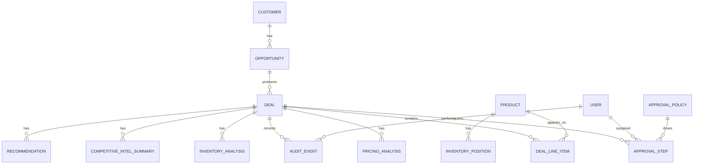

# Data Model

## Overview

The data model should support deal intake, line-item pricing, inventory analysis, competitive intelligence, recommendation generation, approval workflow, audit trail, and executive reporting.

This document describes the conceptual and logical data model. It is intentionally implementation-neutral and does not prescribe database syntax.

## Core Entities

## Entity Definitions

### User

Represents an application user.

Key fields:

- User ID
- Name
- Email
- Department
- Region
- Manager ID
- Active status
- Created timestamp
- Updated timestamp

Relationships:

- Has one or more roles.
- May submit deals.
- May approve assigned workflow steps.
- May generate audit events.

### Role

Represents a permission or workflow role.

Example roles:

- Sales Representative
- Sales Manager
- Pricing Analyst
- Finance Approver
- Operations Reviewer
- Legal Reviewer
- Executive
- Administrator

Key fields:

- Role ID
- Role name
- Description
- Permission set

### User Role

Associates users with roles.

Key fields:

- User role ID
- User ID
- Role ID
- Scope type
- Scope value

Example scopes:

- Global
- Region
- Sales team
- Product line
- Customer segment

### Customer

Represents the buying organization.

Key fields:

- Customer ID
- Customer name
- Segment
- Industry
- Region
- Strategic account flag
- Credit status
- Annual revenue potential
- Account owner ID
- Created timestamp
- Updated timestamp

### Opportunity

Represents a sales opportunity that may produce one or more deal requests.

Key fields:

- Opportunity ID
- Customer ID
- Opportunity name
- Sales stage
- Expected close date
- Forecast category
- Opportunity value
- Owner ID
- CRM reference ID
- Created timestamp
- Updated timestamp

### Deal

Represents a commercial deal approval request.

Key fields:

- Deal ID
- Deal number
- Opportunity ID
- Customer ID
- Submitted by user ID
- Deal title
- Status
- Deal type
- Region
- Customer segment
- Requested effective date
- Target close date
- Contract duration months
- Payment terms
- Strategic rationale
- Total list price
- Total proposed price
- Total discount amount
- Total discount percent
- Estimated gross margin percent
- Overall risk rating
- Current recommendation ID
- Current approval step ID
- Created timestamp
- Submitted timestamp
- Updated timestamp

Example statuses:

- Draft
- Submitted
- In Analysis
- Pending Approval
- Changes Requested
- Escalated
- Approved
- Rejected
- Withdrawn
- Expired

### Deal Line Item

Represents an individual product or service included in a deal.

Key fields:

- Deal line item ID
- Deal ID
- Product ID
- Quantity
- Unit list price
- Proposed unit price
- Discount percent
- Extended list price
- Extended proposed price
- Estimated unit cost
- Estimated gross margin amount
- Estimated gross margin percent
- Requested delivery date
- Line status
- Notes

### Product

Represents an item available for sale.

Key fields:

- Product ID
- SKU
- Product name
- Product family
- Product line
- Category
- Standard list price
- Standard cost
- Margin target percent
- Active status
- Lead time days
- Inventory tracked flag

### Price Book

Represents pricing by market, customer segment, product, or effective date.

Key fields:

- Price book ID
- Name
- Region
- Segment
- Currency
- Effective start date
- Effective end date
- Active status

### Price Book Entry

Represents a product price in a price book.

Key fields:

- Price book entry ID
- Price book ID
- Product ID
- List price
- Floor price
- Target margin percent
- Currency
- Effective start date
- Effective end date

### Inventory Position

Represents inventory availability and constraints for a product.

Key fields:

- Inventory position ID
- Product ID
- Location
- Region
- On hand quantity
- Reserved quantity
- Available quantity
- Backordered quantity
- Forecast supply quantity
- Forecast supply date
- Allocation restricted flag
- Last refreshed timestamp

### Competitive Intelligence Record

Represents raw or curated competitor context.

Key fields:

- Competitive intel ID
- Customer ID
- Opportunity ID
- Product ID
- Competitor name
- Signal type
- Summary
- Source
- Source URL or reference
- Confidence
- Observed date
- Created by user ID
- Created timestamp

Example signal types:

- Competitor mentioned
- Price pressure
- Prior loss
- Prior win
- Feature comparison
- Incumbent vendor
- Market trend

### Pricing Analysis

Represents a structured pricing analysis result for a deal.

Key fields:

- Pricing analysis ID
- Deal ID
- Analysis status
- Total discount percent
- Discount policy threshold
- Margin target percent
- Estimated margin percent
- Margin variance percent
- Historical comparable count
- Pricing risk rating
- Exception flags
- Summary
- Source references
- Created timestamp
- Created by system or user ID

### Inventory Analysis

Represents a structured inventory analysis result for a deal.

Key fields:

- Inventory analysis ID
- Deal ID
- Analysis status
- Overall inventory risk rating
- Shortage flag
- Allocation risk flag
- Earliest feasible fulfillment date
- At-risk line count
- Summary
- Source references
- Created timestamp
- Created by system or user ID

### Competitive Intel Summary

Represents AI-assisted synthesis of competitive context for a deal.

Key fields:

- Competitive summary ID
- Deal ID
- Summary status
- Known competitors
- Competitive pressure rating
- Key facts
- Inferences
- Source references
- Confidence
- Created timestamp
- Model metadata ID

### Recommendation

Represents the system recommendation for a deal.

Key fields:

- Recommendation ID
- Deal ID
- Recommended action
- Confidence
- Overall risk rating
- Pricing risk rating
- Inventory risk rating
- Competitive pressure rating
- Rationale
- Conditions
- Required approver roles
- Source analysis IDs
- Model metadata ID
- Prompt template version
- Created timestamp
- Superseded timestamp

Example recommended actions:

- Approve
- Approve with conditions
- Request revision
- Escalate
- Reject

### Approval Policy

Represents rules used to determine approval routing.

Key fields:

- Approval policy ID
- Policy name
- Description
- Active status
- Priority
- Applies to region
- Applies to segment
- Applies to product line
- Condition expression
- Required approver role
- Approval sequence
- Escalation threshold hours
- Created timestamp
- Updated timestamp

### Approval Step

Represents an individual approval task.

Key fields:

- Approval step ID
- Deal ID
- Approval policy ID
- Step sequence
- Step type
- Assigned role
- Assigned user ID
- Status
- Decision
- Decision reason
- Comment
- Due timestamp
- Started timestamp
- Completed timestamp
- Escalated timestamp

Example statuses:

- Pending
- In Review
- Approved
- Rejected
- Changes Requested
- Skipped
- Escalated
- Canceled

### Approval Comment

Represents comments made during review.

Key fields:

- Comment ID
- Deal ID
- Approval step ID
- User ID
- Comment body
- Visibility
- Created timestamp
- Updated timestamp

### Audit Event

Represents immutable system and user activity.

Key fields:

- Audit event ID
- Entity type
- Entity ID
- Deal ID
- Actor type
- Actor user ID
- Action
- Previous value
- New value
- Source
- Source IP or session ID
- Correlation ID
- Created timestamp
- Metadata

Example actions:

- Deal created
- Deal submitted
- Deal updated
- Analysis generated
- Recommendation generated
- Approval assigned
- Approval completed
- Changes requested
- Deal escalated
- Deal approved
- Deal rejected
- AI output overridden

### Model Metadata

Represents AI model call metadata.

Key fields:

- Model metadata ID
- Provider
- Model name
- Model version
- Prompt template ID
- Prompt template version
- Input reference hash
- Output schema version
- Latency milliseconds
- Token usage
- Created timestamp

### Dashboard Metric Snapshot

Represents aggregated metrics for reporting.

Key fields:

- Snapshot ID
- Snapshot date
- Metric name
- Metric value
- Dimension name
- Dimension value
- Filter context
- Created timestamp

## Important Relationships

- A customer has many opportunities.
- An opportunity has many deals.
- A deal has many line items.
- A deal has many analyses and recommendations over time.
- A deal has one current recommendation.
- A deal has many approval steps.
- Approval policies generate approval steps.
- A deal has many audit events.
- AI-generated summaries reference model metadata.

## Derived Fields

The following fields should generally be derived rather than manually entered:

- Total list price
- Total proposed price
- Total discount amount
- Total discount percent
- Estimated gross margin amount
- Estimated gross margin percent
- Pricing risk rating
- Inventory risk rating
- Overall risk rating
- Current approval step
- Approval cycle time

## Audit Requirements

Audit records should be created for:

- Creation, edit, submission, withdrawal, approval, rejection, escalation, and status changes.
- Analysis generation and regeneration.
- Recommendation generation and supersession.
- AI output override.
- Approval comment creation.
- Policy changes.
- Sensitive data access where required.

Audit records should not be physically deleted through normal application flows.

## Data Quality Requirements

- Deal line items require product, quantity, and proposed price.
- Submitted deals require customer, opportunity or deal title, target close date, and strategic rationale.
- Pricing analysis requires list price and estimated cost or margin input.
- Inventory analysis requires inventory-tracked products and availability data.
- Recommendation generation requires completed pricing and policy checks.
- AI summaries should include source references or explicitly state when source data is insufficient.

## Data Retention Considerations

- Deals and approvals should be retained according to commercial and compliance policy.
- Audit events should be retained at least as long as related deal records.
- AI inputs and outputs should be retained only as needed for traceability and governance.
- Sensitive fields may need masking in lower environments.

