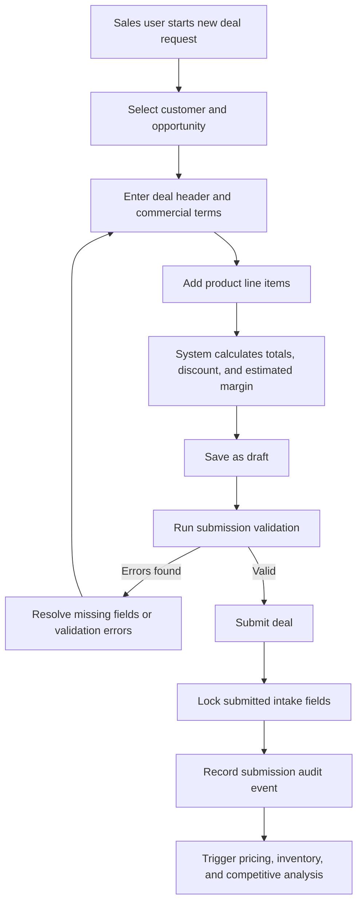
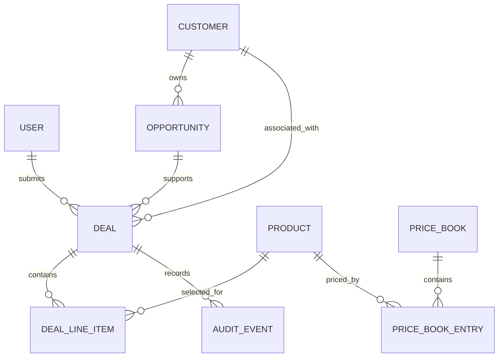

# Module 1: Commercial Deal Intake

## Purpose

Commercial Deal Intake is the entry point for the Commercial Deal Desk Copilot workflow. It gives sales users a structured way to submit commercial deal requests with enough customer, opportunity, product, pricing, delivery, and commercial context for downstream analysis and approval.

The module should replace informal email or spreadsheet-based intake with a consistent, auditable, validation-driven process. It should make deal submission easier for sales while giving pricing, finance, operations, and management reviewers the context they need without repeated follow-up.

## Scope

### In Scope for MVP

- Create a new deal request.
- Save a deal as draft.
- Edit a draft deal.
- Add, edit, and remove deal line items.
- Select customer, opportunity, products, and price book values from demo data.
- Capture requested pricing, delivery dates, payment terms, contract duration, and strategic rationale.
- Calculate deal totals, discount, and estimated margin.
- Validate required fields before submission.
- Submit a deal for analysis.
- Record audit events for create, edit, save draft, line item changes, and submit.
- Display a read-only deal summary after submission.

### Out of Scope for MVP

- Live CRM import.
- Live CPQ quote import.
- Contract document generation.
- Customer-facing proposal generation.
- Attachment processing.
- Bulk line item upload.
- Mobile-native intake.
- Automated customer negotiation.
- Final approval decisions.

## Primary Users

### Sales Representative

Creates and submits deal requests. The sales representative owns the initial deal context, requested pricing, delivery needs, and strategic rationale.

Key permissions:

- Create deal.
- Edit own draft deals.
- Submit own draft deals.
- View own submitted deals.
- Respond to requested changes in later workflow modules.

### Sales Manager

Reviews submitted deal context and may help refine requests before formal approval.

Key permissions:

- View deals for assigned team or region.
- Create deals on behalf of a sales representative when permitted.
- Edit drafts where assigned as owner or manager.
- View calculated totals and intake completeness.

### Administrator

Configures demo data, required fields, and reference records during MVP setup.

Key permissions:

- View all deal intake records.
- Manage reference data in future phases.
- Inspect audit history.

### Read-Only Reviewer

Pricing, finance, operations, legal, and executive users may view submitted intake information as part of downstream modules.

Key permissions:

- View submitted deal data within authorization scope.
- Cannot edit submitted intake fields unless the workflow explicitly requests changes.

## Process Flow

## Workflow States

### Draft

The deal has been created but not submitted.

Allowed actions:

- Edit header fields.
- Add, edit, or remove line items.
- Save draft.
- Submit when validation passes.
- Delete or withdraw draft where permitted.

### Submitted

The deal has passed intake validation and entered the analysis workflow.

Allowed actions:

- View submitted information.
- View analysis status.
- Add comments in later workflow modules.
- Withdraw if no approval action has occurred and policy permits.

### In Analysis

The system is generating pricing, inventory, competitive intelligence, and recommendation context.

Allowed actions:

- View submitted information.
- View analysis progress.
- No direct edits to submitted fields.

### Changes Requested

An approver has requested edits.

Allowed actions:

- Edit fields identified by the requested change.
- Add response comment.
- Resubmit.

### Withdrawn

The submitter or authorized manager withdrew the deal.

Allowed actions:

- View historical record.
- Clone into a new draft in a future phase.

## Form Structure

The intake form should use clear sections that match how users think about a deal. The form should support saving progress without requiring all submission fields immediately.

### Section 1: Deal Header

Purpose:

Capture the basic identity and ownership of the deal.

Fields:

| Field | Type | Required for Draft | Required for Submission | Notes |
| --- | --- | --- | --- | --- |
| Deal Title | Text | Yes | Yes | Short descriptive name. |
| Deal Type | Select | No | Yes | New sale, renewal, expansion, competitive replacement, strategic exception. |
| Submitted By | User reference | Auto | Yes | Defaults to current user. |
| Sales Owner | User reference | Auto | Yes | Defaults to current user; editable by manager or admin. |
| Sales Manager | User reference | Auto | Yes | Derived from sales owner where possible. |
| Region | Select | No | Yes | Defaults from customer or sales owner. |
| Currency | Select | No | Yes | MVP can default to USD. |
| Target Close Date | Date | No | Yes | Must be today or future date for active submissions. |
| Requested Effective Date | Date | No | Yes | Date commercial terms should begin. |

### Section 2: Customer and Opportunity

Purpose:

Connect the deal to a customer and selling motion.

Fields:

| Field | Type | Required for Draft | Required for Submission | Notes |
| --- | --- | --- | --- | --- |
| Customer | Lookup | Yes | Yes | Selected from demo customer dataset. |
| Customer Segment | Read-only | Auto | Yes | Derived from customer. |
| Industry | Read-only | Auto | No | Derived from customer. |
| Customer Region | Read-only | Auto | Yes | Derived from customer. |
| Strategic Account | Read-only flag | Auto | No | Derived from customer. |
| Credit Status | Read-only | Auto | No | Visible to authorized roles only if sensitive. |
| Opportunity | Lookup | No | Conditional | Required if an opportunity exists for the customer. |
| Opportunity Stage | Read-only | Auto | No | Derived from opportunity. |
| Forecast Category | Read-only | Auto | No | Derived from opportunity. |

### Section 3: Commercial Terms

Purpose:

Capture terms that influence approval routing and risk.

Fields:

| Field | Type | Required for Draft | Required for Submission | Notes |
| --- | --- | --- | --- | --- |
| Payment Terms | Select | No | Yes | Net 30, Net 45, Net 60, Net 90, custom. |
| Contract Duration Months | Number | No | Yes | Must be positive. |
| Requested Billing Frequency | Select | No | No | Annual, quarterly, monthly, milestone. |
| Renewal Option | Select | No | No | None, annual renewal, auto-renewal, custom. |
| Special Terms Requested | Boolean | No | Yes | Drives additional explanation when true. |
| Special Terms Description | Long text | No | Conditional | Required when special terms are requested. |

### Section 4: Deal Line Items

Purpose:

Capture products, quantities, proposed pricing, and requested delivery dates.

Fields:

| Field | Type | Required for Draft | Required for Submission | Notes |
| --- | --- | --- | --- | --- |
| Product | Lookup | Yes for line | Yes | Selected from product catalog. |
| SKU | Read-only | Auto | Yes | Derived from product. |
| Product Line | Read-only | Auto | Yes | Derived from product. |
| Quantity | Number | Yes for line | Yes | Must be greater than zero. |
| Unit List Price | Currency | Auto | Yes | Derived from price book. |
| Proposed Unit Price | Currency | No | Yes | Must be greater than or equal to zero. |
| Discount Percent | Calculated | Auto | Yes | Derived from list and proposed price. |
| Extended List Price | Calculated | Auto | Yes | Quantity multiplied by unit list price. |
| Extended Proposed Price | Calculated | Auto | Yes | Quantity multiplied by proposed unit price. |
| Estimated Unit Cost | Read-only | Auto | Yes | Visible only to authorized roles if sensitive. |
| Estimated Margin Percent | Calculated | Auto | Yes | May be hidden from sales if policy requires. |
| Requested Delivery Date | Date | No | Conditional | Required for inventory-tracked products. |
| Line Notes | Text | No | No | Optional context. |

### Section 5: Strategic Rationale

Purpose:

Explain why the deal should be approved, especially when exceptions are present.

Fields:

| Field | Type | Required for Draft | Required for Submission | Notes |
| --- | --- | --- | --- | --- |
| Business Justification | Long text | No | Yes | Minimum useful length recommended. |
| Competitive Situation | Select | No | Yes | None known, incumbent competitor, price pressure, feature comparison, unknown. |
| Known Competitor | Lookup or text | No | Conditional | Required when competitive situation is not none or unknown. |
| Customer Decision Deadline | Date | No | No | Used for urgency and prioritization. |
| Executive Sponsor | Text or user lookup | No | No | Optional. |
| Renewal or Expansion Impact | Long text | No | No | Useful for strategic accounts. |

### Section 6: Review and Submit

Purpose:

Show completeness, calculated totals, and validation results before submission.

Fields and content:

- Deal total list price.
- Deal total proposed price.
- Total discount amount.
- Total discount percent.
- Estimated gross margin percent.
- Number of line items.
- Validation status.
- Missing required fields.
- Policy preview where available.
- Submit button.
- Save draft button.

## Validation Rules

### Draft Validation

Draft validation should be minimal so users can save incomplete work.

Rules:

- Deal title is required.
- Customer is required.
- Each saved line item must have a product and quantity.
- Quantity must be greater than zero.
- Proposed unit price cannot be negative when provided.
- Dates must use valid date format.

### Submission Validation

Submission validation should ensure downstream modules have enough information to analyze the deal.

Rules:

- Deal title is required.
- Deal type is required.
- Customer is required.
- Region is required.
- Currency is required.
- Target close date is required.
- Requested effective date is required.
- Payment terms are required.
- Contract duration months is required and must be greater than zero.
- At least one line item is required.
- Every line item must have product, quantity, unit list price, proposed unit price, and requested delivery date when inventory-tracked.
- Proposed unit price must be greater than or equal to zero.
- Proposed unit price cannot exceed unit list price unless manager override is enabled.
- Total proposed deal value must be greater than zero.
- Business justification is required.
- Known competitor is required when competitive situation indicates competitor pressure.
- Special terms description is required when special terms are requested.
- Target close date cannot be earlier than the current date unless the deal is marked as retrospective correction by an administrator.
- Requested effective date cannot be earlier than the current date for standard submissions.

### Warning-Level Validation

Warnings should not block submission, but should clearly inform the user that additional review may be triggered.

Warnings:

- Discount exceeds 15 percent.
- Estimated margin is below target.
- Payment terms exceed Net 60.
- Contract duration exceeds 36 months.
- Requested delivery date is earlier than standard lead time.
- Customer credit status is watch or hold.
- Strategic account flag is true and discount exceeds standard threshold.
- Competitive situation is unknown for a large deal.

### Blocking Validation

Blocking validations prevent submission.

Blocking rules:

- Missing required submission fields.
- No line items.
- Quantity less than or equal to zero.
- Negative proposed price.
- Missing proposed price.
- Missing customer.
- Inactive product.
- Inactive customer.
- User lacks permission to submit for selected region or account.

## Calculations

### Line-Level Calculations

- Extended list price = quantity multiplied by unit list price.
- Extended proposed price = quantity multiplied by proposed unit price.
- Discount amount = extended list price minus extended proposed price.
- Discount percent = discount amount divided by extended list price.
- Estimated gross margin amount = extended proposed price minus estimated total cost.
- Estimated gross margin percent = estimated gross margin amount divided by extended proposed price.

### Deal-Level Calculations

- Total list price = sum of line extended list prices.
- Total proposed price = sum of line extended proposed prices.
- Total discount amount = total list price minus total proposed price.
- Total discount percent = total discount amount divided by total list price.
- Estimated gross margin amount = sum of line estimated gross margin amounts.
- Estimated gross margin percent = total estimated gross margin amount divided by total proposed price.

### Calculation Display Rules

- Sales users may see discount and proposed price.
- Margin may be hidden, rounded, or shown as a risk indicator depending on permission policy.
- Pricing, finance, and executive users should see full margin detail.
- Calculated fields should update immediately when line items change.

## Sample Deal Request

### Deal Header

| Field | Value |
| --- | --- |
| Deal Title | Northstar Health Systems Device Refresh |
| Deal Type | Competitive replacement |
| Submitted By | Maya Chen |
| Sales Owner | Maya Chen |
| Sales Manager | Jordan Blake |
| Region | North America |
| Currency | USD |
| Target Close Date | 2026-07-31 |
| Requested Effective Date | 2026-08-15 |

### Customer and Opportunity

| Field | Value |
| --- | --- |
| Customer | Northstar Health Systems |
| Segment | Enterprise |
| Industry | Healthcare |
| Strategic Account | Yes |
| Credit Status | Good |
| Opportunity | Northstar 2026 Device Refresh |
| Opportunity Stage | Proposal |
| Forecast Category | Commit |

### Commercial Terms

| Field | Value |
| --- | --- |
| Payment Terms | Net 60 |
| Contract Duration Months | 36 |
| Billing Frequency | Annual |
| Special Terms Requested | Yes |
| Special Terms Description | Customer requests phased rollout schedule and renewal price protection for year two. |

### Line Items

| Product | SKU | Quantity | Unit List Price | Proposed Unit Price | Discount | Requested Delivery |
| --- | --- | ---: | ---: | ---: | ---: | --- |
| Core Hardware Unit | HW-100 | 20 | 12000 | 9600 | 20% | 2026-08-15 |
| Enterprise Software License | SW-ENT | 20 | 18000 | 15300 | 15% | 2026-08-15 |
| Implementation Services | SVC-IMP | 1 | 15000 | 12000 | 20% | 2026-08-01 |

### Strategic Rationale

Business justification:

Northstar is a strategic healthcare account planning a device refresh across multiple facilities. Competitor A is the incumbent and has offered bundled support credits. Approval of the requested discount is expected to secure the initial refresh and create expansion opportunity for premium support in the next fiscal year.

Competitive situation:

Incumbent competitor.

Known competitor:

Competitor A.

### Calculated Summary

| Metric | Value |
| --- | ---: |
| Total List Price | 615000 |
| Total Proposed Price | 510000 |
| Total Discount Amount | 105000 |
| Total Discount Percent | 17.1% |
| Estimated Gross Margin Percent | 48.2% |

### Expected Intake Outcome

- Submission allowed if all required fields are complete.
- Warning shown for discount above 15 percent.
- Warning shown because strategic account has competitive pressure.
- Downstream approval likely requires Sales Manager, Pricing Analyst, and Finance Approver.

## Data Model

The Module 1 design uses the core entities already defined in the repository data model, with emphasis on deal creation and line item capture.

### Deal Entity

Primary fields for intake:

| Field | Description |
| --- | --- |
| Deal ID | Unique system identifier. |
| Deal Number | Human-readable identifier generated on creation. |
| Deal Title | User-entered name for the request. |
| Deal Type | Commercial reason or selling motion. |
| Customer ID | Linked customer. |
| Opportunity ID | Linked opportunity when available. |
| Submitted By User ID | User who submits the deal. |
| Sales Owner ID | User responsible for the deal. |
| Sales Manager ID | Manager associated with the sales owner. |
| Status | Draft, Submitted, In Analysis, Changes Requested, Withdrawn. |
| Region | Commercial region. |
| Currency | Transaction currency. |
| Target Close Date | Expected customer decision or close date. |
| Requested Effective Date | Desired start date. |
| Payment Terms | Requested payment terms. |
| Contract Duration Months | Requested contract length. |
| Special Terms Requested | Boolean indicator. |
| Special Terms Description | Explanation of non-standard terms. |
| Strategic Rationale | User-entered business justification. |
| Competitive Situation | User-selected competitive context. |
| Known Competitor | Competitor named by sales when known. |
| Total List Price | Derived total. |
| Total Proposed Price | Derived total. |
| Total Discount Amount | Derived total. |
| Total Discount Percent | Derived percentage. |
| Estimated Gross Margin Percent | Derived percentage. |
| Created Timestamp | Created time. |
| Updated Timestamp | Last edited time. |
| Submitted Timestamp | Submission time. |

### Deal Line Item Entity

Primary fields for intake:

| Field | Description |
| --- | --- |
| Deal Line Item ID | Unique line identifier. |
| Deal ID | Parent deal. |
| Product ID | Selected product. |
| Quantity | Requested quantity. |
| Unit List Price | Price from selected price book. |
| Proposed Unit Price | Requested sale price. |
| Discount Amount | Derived line discount. |
| Discount Percent | Derived line discount percentage. |
| Extended List Price | Derived list total. |
| Extended Proposed Price | Derived proposed total. |
| Estimated Unit Cost | Product cost used for margin calculation. |
| Estimated Gross Margin Amount | Derived line margin. |
| Estimated Gross Margin Percent | Derived line margin percentage. |
| Requested Delivery Date | Desired delivery date for the line. |
| Line Notes | Optional context. |
| Created Timestamp | Created time. |
| Updated Timestamp | Last edited time. |

### Audit Event Entity

Intake events:

| Action | Trigger |
| --- | --- |
| Deal created | User starts and saves a new draft. |
| Deal updated | User changes header, customer, terms, or rationale. |
| Deal line item added | User adds a product line. |
| Deal line item updated | User changes quantity, price, date, or notes. |
| Deal line item removed | User removes a line. |
| Deal validation failed | User attempts submission but blocking validation fails. |
| Deal submitted | User successfully submits the deal. |
| Deal withdrawn | User withdraws an eligible deal. |

## UI Mockup Description

The Deal Intake UI should feel like an operational workspace rather than a marketing page. It should be dense enough for repeated use, but structured enough that first-time users understand what is missing before submission.

### Page Layout

Top bar:

- Deal title or "New Deal Request".
- Status badge.
- Save draft action.
- Submit action.
- More actions menu for withdraw or clone in future phases.

Main body:

- Left primary column for form sections.
- Right summary column for totals, validation status, and submission readiness.

Recommended section order:

1. Deal Header
2. Customer and Opportunity
3. Commercial Terms
4. Deal Line Items
5. Strategic Rationale
6. Review and Submit

### Right Summary Panel

The summary panel should remain visible on desktop while the user edits.

Contents:

- Total list price.
- Total proposed price.
- Total discount percent.
- Estimated margin indicator where permitted.
- Line item count.
- Missing required fields count.
- Warning count.
- Submission readiness state.

Readiness states:

- Draft incomplete.
- Ready to submit.
- Submitted.
- Changes requested.

### Deal Line Item Grid

The line item grid should support quick entry and scanning.

Columns:

- Product.
- SKU.
- Quantity.
- Unit list price.
- Proposed unit price.
- Discount.
- Extended proposed price.
- Requested delivery date.
- Line notes.
- Row actions.

Behavior:

- Product selection fills SKU, product line, standard list price, cost, and lead time.
- Quantity and proposed unit price update calculated fields immediately.
- Invalid cells show inline messages.
- Users can add another line without leaving the grid.

### Validation Experience

Validation should be visible before the user presses submit.

Recommended patterns:

- Section-level completion indicators.
- Inline field errors.
- Summary panel list of blocking issues.
- Warning messages separated from blocking errors.
- Submit button disabled only for clearly blocking errors.

### Submitted Deal View

After submission, the intake form becomes read-only and shows:

- Submitted timestamp.
- Submitter.
- Deal summary.
- Line items.
- Validation warnings at submission.
- Analysis status.
- Audit timeline preview.

## Implementation Notes

### Module Boundaries

Commercial Deal Intake should own:

- Deal draft creation.
- Intake form validation.
- Line item entry.
- Deal total calculations.
- Submission transition from Draft to Submitted.
- Initial audit events.

Commercial Deal Intake should not own:

- Pricing risk analysis.
- Inventory risk analysis.
- Competitive intelligence synthesis.
- AI recommendation generation.
- Approval decisions.
- Executive dashboard aggregation.

### Submission Contract

When a deal is submitted, the module should provide downstream modules with:

- Deal header.
- Customer and opportunity context.
- Commercial terms.
- Complete line item list.
- Calculated totals.
- Strategic rationale.
- Competitive situation provided by sales.
- Submission timestamp.
- Submitter and owner.

### State Transition Rules

- Draft can move to Submitted only after blocking validation passes.
- Submitted can move to In Analysis when analysis jobs start.
- Submitted and In Analysis records should not allow unrestricted editing.
- Changes Requested can move back to Submitted after requested edits are made and validation passes.
- Withdrawn should be terminal for the original deal record in MVP.

### Audit Logging

Audit events should be created in the same logical transaction as important state changes wherever possible.

Minimum audit metadata:

- Actor user ID.
- Actor role.
- Entity type.
- Entity ID.
- Deal ID.
- Action.
- Previous value where relevant.
- New value where relevant.
- Timestamp.
- Source.
- Correlation ID.

### Permissions

Permission checks should apply to:

- Creating deals.
- Viewing customers.
- Selecting opportunities.
- Editing drafts.
- Submitting deals.
- Viewing margin-sensitive calculated values.
- Withdrawing deals.

Sales representatives should generally edit only their own drafts. Sales managers should see team deals. Administrators should have broad access for setup and support.

### Data Freshness

The intake module should display when reference data was last refreshed if using imported customer, price book, product, or inventory data in future phases.

For MVP seeded data, the system can show static demo labels instead of live freshness timestamps.

### Error Handling

Expected error cases:

- Selected product becomes inactive.
- Customer becomes inactive.
- Price book entry is missing.
- User lacks permission for selected region.
- Calculations cannot be completed because cost or list price is missing.
- Submission fails because another process changed the deal status.

Recommended behavior:

- Preserve user-entered draft data.
- Show clear field-level or section-level error.
- Avoid silent data changes.
- Record failed submission attempts as audit events when meaningful.

### Accessibility and Usability

- All form fields should have clear labels.
- Required fields should be indicated consistently.
- Validation messages should be text-based and not rely on color alone.
- Keyboard navigation should work through the line item grid.
- Currency and percentage fields should be formatted consistently.
- Date fields should accept typed dates and picker selection.

### Future Enhancements

- CRM opportunity import.
- CPQ quote import.
- Attachment support.
- Approval policy preview before submit.
- AI-assisted draft completion.
- Bulk line item upload.
- Duplicate deal detection.
- Deal cloning.
- Guided intake wizard for infrequent users.
- Advanced permission scopes by product line or account team.

## Acceptance Criteria

- A sales user can create a deal draft.
- A sales user can select customer and opportunity context from demo data.
- A sales user can add one or more line items.
- The system calculates line and deal totals.
- The user can save an incomplete draft.
- The system prevents submission when blocking required fields are missing.
- The system shows warning-level issues without blocking submission.
- The user can submit a complete deal.
- Submitted deal fields become read-only for standard users.
- Submission creates an audit event.
- The submitted deal is ready for pricing, inventory, competitive intelligence, and recommendation modules.

