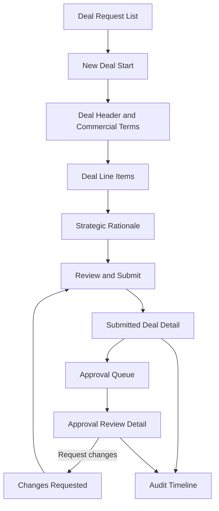

# Module 1 UI Mockups: Commercial Deal Intake

## Purpose

This document defines the screen-level UI design for Module 1: Commercial Deal Intake. It translates the deal intake requirements, validation rules, approval-routing expectations, and pharmaceutical demo datasets into practical desktop and mobile screen mockups.

The screens described here are documentation-only. No production code is included.

## Design Goals

- Make commercial deal submission fast and structured for sales users.
- Show enough context for pricing, finance, market access, operations, legal, and executives to review without repeated follow-up.
- Keep the desktop experience dense, scannable, and workflow-oriented.
- Keep the mobile experience focused on status review, lightweight edits, comments, and approvals.
- Make required fields, warnings, and approval consequences visible before submission.
- Support pharmaceutical commercial workflows involving WAC/list price, proposed net price, rebates, formulary access, cold-chain supply, specialty distribution, GPOs, payers, and IDNs.

## Source Inputs

The UI mockups are based on:

- `docs/Module_1_Deal_Intake.md`
- `demo-data/Deal_Request_Form.xlsx`
- `demo-data/Customer_Master.xlsx`
- `demo-data/Product_Master.xlsx`
- `demo-data/Approval_Matrix.xlsx`
- `demo-data/Sample_Deal_Requests.xlsx`

Relevant demo examples:

- Northstar Health Systems oncology infusion expansion.
- Meridian Specialty Pharmacy biosimilar conversion.
- Apex National GPO formulary access deal.
- HelioRx Distribution rare disease EU launch.
- Summit Oncology Clinics biosimilar pilot.
- Cityline Payer Alliance cardiology rebate renewal.

Relevant demo products:

- Oncavax IV 100mg Vial.
- Oncavax IV 500mg Vial.
- Rheumera Biosimilar Pen.
- Cardiovex 50mg Tablet Pack.
- Lysomab Rare Disease Kit.
- Companion Diagnostic Panel.
- Patient Start Program.
- Formulary Access Rebate.

## Navigation Model

The Module 1 UI should include these primary navigation destinations:

- Deal Requests
- New Deal
- My Drafts
- Submitted Deals
- Approval Queue
- Reference Data
- Audit Timeline

The MVP should keep navigation simple. The user should never need to understand system modules to complete a deal request.

## Desktop Information Architecture

Desktop screens should use a three-zone layout:

```text
+--------------------------------------------------------------------------------+
| Top Navigation                                                                  |
| Deal Requests | New Deal | Approval Queue | Dashboards | Reference Data         |
+--------------------------------------------------------------------------------+
| Page Header                                                                     |
| Title, status, owner, primary actions                                           |
+-----------------------------------------------+--------------------------------+
| Main Work Area                                | Right Context Panel            |
| Form, table, workflow, or approval content    | Totals, validation, route, SLA |
+-----------------------------------------------+--------------------------------+
```

Desktop should prioritize:

- Wide line-item grids.
- Persistent deal summary.
- Inline validation.
- Side-by-side approval and commercial context.
- Quick scanning of high-risk commercial details.

## Mobile Information Architecture

Mobile screens should use a stacked layout:

```text
+----------------------------------+
| Compact Header                   |
| Back | Deal # | Status           |
+----------------------------------+
| Sticky Summary Strip             |
| Value | Discount | Risk          |
+----------------------------------+
| Section Tabs or Accordion        |
| Header | Customer | Lines | etc. |
+----------------------------------+
| Active Section Content           |
+----------------------------------+
| Bottom Action Bar                |
| Save | Submit or Approve         |
+----------------------------------+
```

Mobile should prioritize:

- Status review.
- Required-field completion.
- Approval decisions.
- Comments.
- Warning review.
- Simple edits to draft fields.

Mobile should not attempt to replicate the full desktop line-item grid. Line items should become expandable cards.

## Screen 1: Deal Request List

### Purpose

Give users a clear view of draft, submitted, and in-progress deals.

### Desktop Layout

```text
+--------------------------------------------------------------------------------+
| Deal Requests                                      [+ New Deal] [Import later]  |
+--------------------------------------------------------------------------------+
| Filters: Status | Region | Account Type | Owner | Risk | Target Close Date     |
+--------------------------------------------------------------------------------+
| KPI Strip: Drafts | Submitted | Changes Requested | High Risk | Avg Cycle Time  |
+--------------------------------------------------------------------------------+
| Deal #   Title                 Customer        Status      Value      Risk      |
| DEAL-3001 Northstar Oncology   Northstar HS    Submitted   $510K      High      |
| DEAL-3002 Meridian Biosimilar  Meridian SP     Draft       $472K      Medium    |
| DEAL-3003 Apex Formulary       Apex GPO        Submitted   $5.1M      High      |
| DEAL-3004 HelioRx Rare Disease HelioRx Dist.   Submitted   EUR 456K   High      |
+--------------------------------------------------------------------------------+
```

### Field Placement

Top area:

- Page title.
- Primary `New Deal` action.
- Secondary future `Import` action disabled or hidden in MVP.

Filter row:

- Status.
- Region.
- Segment.
- Account type.
- Owner.
- Risk.
- Target close date.

Table columns:

- Deal number.
- Deal title.
- Customer.
- Account type.
- Region.
- Owner.
- Status.
- Target close date.
- Total proposed value.
- Discount percent.
- Intake risk.
- Next action.

### States

- Empty state: show `Create first deal request`.
- Loading state: skeleton rows.
- No filtered results: show filter reset option.
- Draft row: editable.
- Submitted row: read-only intake with analysis status.
- Changes requested row: highlighted and routed to edit flow.

## Screen 2: New Deal Start

### Purpose

Start a deal with the fewest possible decisions while still anchoring it to customer and opportunity context.

### Desktop Layout

```text
+--------------------------------------------------------------------------------+
| New Deal Request                                             [Save Draft] [Next]|
+--------------------------------------------------------------------------------+
| Stepper: 1 Customer -> 2 Deal Terms -> 3 Line Items -> 4 Rationale -> 5 Review |
+--------------------------------------------------------------------------------+
| Select Customer                                                               |
| [Search customer by name, ID, account owner, region]                           |
|                                                                                |
| Suggested Customers                                                            |
| Northstar Health Systems | IDN | Enterprise | Strategic | Credit: Good         |
| Apex National GPO        | GPO | Enterprise | Strategic | Credit: Watch        |
| HelioRx Distribution     | Distributor | EMEA | Strategic | Credit: Good       |
|                                                                                |
| Select Opportunity                                                             |
| [Northstar Oncology Infusion Expansion]                                        |
+------------------------------------------------+-------------------------------+
| Selected Customer Context                       | Intake Readiness             |
| Segment: Enterprise                             | Customer selected: Yes       |
| Industry: Healthcare Provider                   | Opportunity selected: Yes    |
| Region: North America                           | Draft can be saved           |
| Strategic Account: Yes                          |                               |
+------------------------------------------------+-------------------------------+
```

### Field Placement

Primary column:

- Customer lookup.
- Customer search results.
- Opportunity lookup filtered by customer.

Right context panel:

- Selected customer summary.
- Credit status.
- Strategic account flag.
- Annual revenue potential.
- Account owner.
- Notes from customer master.

### Demo Data Behavior

Selecting `Northstar Health Systems` should populate:

- Segment: Enterprise.
- Account type: Integrated Delivery Network.
- Region: North America.
- Strategic account: Yes.
- Credit status: Good.
- Account owner: Maya Chen.

Selecting `Apex National GPO` should show a warning because credit status is Watch and the account is strategic.

## Screen 3: Deal Header and Commercial Terms

### Purpose

Capture commercial context that affects validation and approval routing.

### Desktop Layout

```text
+--------------------------------------------------------------------------------+
| New Deal Request: Northstar Oncology Infusion Expansion          Draft          |
+--------------------------------------------------------------------------------+
| Stepper: Customer | Deal Terms | Line Items | Rationale | Review               |
+------------------------------------------------+-------------------------------+
| Deal Header                                    | Deal Summary                  |
| Deal Title             [Northstar Oncology...] | Status: Draft                 |
| Deal Type              [Competitive replacement]                               |
| Sales Owner            [Maya Chen]             | Required fields: 6 remaining  |
| Sales Manager          [Jordan Blake]          | Warning count: 0              |
| Region                 [North America]         | Estimated route: Not ready    |
| Currency               [USD]                   |                               |
| Target Close Date      [2026-07-31]            |                               |
| Requested Effective    [2026-08-15]            |                               |
|                                                |                               |
| Commercial Terms                              |                               |
| Payment Terms          [Net 60]                |                               |
| Contract Months        [36]                    |                               |
| Billing Frequency      [Annual]                |                               |
| Special Terms?         [Yes]                   |                               |
| Special Terms Detail   [Phased rollout...]     |                               |
+------------------------------------------------+-------------------------------+
```

### Field Placement

Deal Header section:

- Deal title.
- Deal type.
- Sales owner.
- Sales manager.
- Region.
- Currency.
- Target close date.
- Requested effective date.

Commercial Terms section:

- Payment terms.
- Contract duration.
- Billing frequency.
- Renewal option.
- Special terms requested.
- Special terms description.

Right context panel:

- Draft status.
- Required fields remaining.
- Warnings.
- Approval route preview.
- Save timestamp.

### Validation Behavior

Inline warnings:

- `Payment Terms: Net 90 will require Finance and Legal review.`
- `Contract Duration: More than 36 months will require Legal review.`
- `Special Terms: Description required before submission.`

Blocking errors:

- Missing deal title.
- Missing target close date.
- Contract duration less than or equal to zero.
- Requested effective date missing.

## Screen 4: Deal Line Items

### Purpose

Capture product-level commercial details and show calculated pricing values.

### Desktop Layout

```text
+--------------------------------------------------------------------------------+
| Deal Line Items                                      [+ Add Product]            |
+--------------------------------------------------------------------------------+
| Product Search: [Oncavax]                                                    |
+--------------------------------------------------------------------------------+
| # | SKU        | Product                  | Qty | WAC/List | Proposed | Disc % |
| 1 | RX-ONC-100 | Oncavax IV 100mg Vial   | 120 | $1,850   | $1,517   | 18.0%  |
| 2 | RX-ONC-500 | Oncavax IV 500mg Vial   | 40  | $7,200   | $5,904   | 18.0%  |
| 3 | SVC-START  | Patient Start Program   | 1   | $35,000  | $31,500  | 10.0%  |
+--------------------------------------------------------------------------------+
| Requested Delivery | Storage         | Supply Risk | Line Notes                 |
| 2026-08-15         | Cold Chain 2-8C | Medium      | Initial infusion order     |
| 2026-08-15         | Cold Chain 2-8C | High        | Allocation-sensitive line  |
| 2026-08-01         | N/A             | Low         | Rollout support            |
+------------------------------------------------+-------------------------------+
| Line Detail Drawer                             | Running Summary               |
| Selected: RX-ONC-500                           | Total List: $545,000          |
| Product Type: Branded Injectable              | Total Proposed: $455,100      |
| Lead Time: 28 days                             | Discount: 16.5%               |
| Inventory tracked: Yes                         | Margin visible by role        |
+------------------------------------------------+-------------------------------+
```

### Field Placement

Grid columns:

- Line number.
- SKU.
- Product name.
- Therapeutic area.
- Quantity.
- Unit list price or WAC.
- Proposed unit price.
- Discount percent.
- Extended list price.
- Extended proposed price.
- Requested delivery date.
- Storage.
- Supply risk.
- Line notes.
- Row actions.

Right or bottom summary:

- Total list value.
- Total proposed value.
- Total discount amount.
- Total discount percent.
- Estimated margin indicator if user can view margin.
- Line count.
- Supply risk preview.

### Product Selection Behavior

When selecting `RX-ONC-500 - Oncavax IV 500mg Vial`, the form should populate:

- Therapeutic area: Oncology.
- Product type: Branded Injectable.
- Storage: Cold Chain 2-8C.
- List price: 7200.
- Standard cost: restricted by role.
- Lead time: 28 days.
- Supply risk: High.
- Inventory tracked: Yes.

### Validation Behavior

Inline cell errors:

- Quantity must be greater than zero.
- Proposed unit price cannot be negative.
- Requested delivery date required for inventory-tracked products.
- Inactive product cannot be submitted.

Warnings:

- Proposed discount exceeds approval threshold.
- Requested delivery date is earlier than lead time.
- Cold-chain line has high supply risk.
- Rebate line has negative proposed price and must be marked as commercial rebate.

## Screen 5: Strategic Rationale

### Purpose

Capture the business justification and competitive context needed for approval review.

### Desktop Layout

```text
+--------------------------------------------------------------------------------+
| Strategic Rationale                                                            |
+------------------------------------------------+-------------------------------+
| Business Justification                         | Competitive Context           |
| [Northstar is a strategic IDN expanding...]    | Situation: Incumbent competitor|
|                                                | Known Competitor: Competitor A |
| Special Terms Description                      | Decision Deadline: 2026-07-20 |
| [Customer requests phased delivery...]         | Executive Sponsor: optional    |
|                                                |                               |
| Renewal or Expansion Impact                    | Suggested Evidence             |
| [Initial infusion volume may expand...]        | Prior win/loss notes           |
|                                                | Formulary pressure             |
|                                                | Account notes                  |
+------------------------------------------------+-------------------------------+
```

### Field Placement

Left column:

- Business justification.
- Special terms description.
- Renewal or expansion impact.

Right column:

- Competitive situation.
- Known competitor.
- Customer decision deadline.
- Executive sponsor.
- Evidence checklist.

### Validation Behavior

Blocking:

- Business justification required before submission.
- Known competitor required when competitive situation is incumbent competitor, price pressure, or feature comparison.
- Special terms description required when special terms requested is Yes.

Warnings:

- Competitive situation is unknown for a deal above $1M.
- Strategic account with high discount needs stronger rationale.
- Payer or GPO deal should include formulary access rationale.

## Screen 6: Review and Submit

### Purpose

Give the submitter a final checkpoint before the deal enters analysis and approval routing.

### Desktop Layout

```text
+--------------------------------------------------------------------------------+
| Review and Submit                                  [Save Draft] [Submit Deal]   |
+--------------------------------------------------------------------------------+
| Submission Readiness: Ready to submit                                           |
+------------------------------------------------+-------------------------------+
| Commercial Summary                             | Validation                    |
| Customer: Northstar Health Systems             | Blocking issues: 0            |
| Opportunity: Oncology Infusion Expansion       | Warnings: 2                   |
| Total List: $545,000                           | - Discount above threshold    |
| Total Proposed: $455,100                       | - Strategic competitive deal  |
| Discount: 16.5%                                |                               |
| Payment Terms: Net 60                          | Estimated Approval Route      |
| Contract: 36 months                            | 1 Sales Manager               |
|                                                | 2 Pricing Analyst             |
| Line Item Summary                              | 3 Finance Approver            |
| 3 products                                     |                               |
| 2 cold-chain lines                             | Audit                         |
| High supply risk: 1 line                       | Submission event will be logged|
+------------------------------------------------+-------------------------------+
```

### Field Placement

Left column:

- Customer and opportunity summary.
- Commercial terms summary.
- Line item summary.
- Strategic rationale preview.

Right column:

- Validation status.
- Blocking issues.
- Warnings.
- Estimated approval route.
- Submit action.
- Audit note.

### Submit Behavior

On submit:

- Run blocking validation.
- Save final intake values.
- Lock submitted intake fields for standard users.
- Create `Deal submitted` audit event.
- Move status to Submitted.
- Trigger downstream analysis modules.

### Confirmation Modal

```text
+------------------------------------------------+
| Submit Deal Request?                           |
|                                                |
| This will lock intake fields and start pricing,|
| inventory, competitive intelligence, and       |
| approval workflow analysis.                    |
|                                                |
| Warnings:                                      |
| - Discount above standard threshold            |
| - Strategic account with competitor pressure   |
|                                                |
| [Cancel]                         [Submit Deal] |
+------------------------------------------------+
```

## Screen 7: Submitted Deal Detail

### Purpose

Show a read-only version of the submitted intake record while downstream analysis runs.

### Desktop Layout

```text
+--------------------------------------------------------------------------------+
| DEAL-3001 Northstar Oncology Infusion Expansion       Submitted                |
| Owner: Maya Chen | Customer: Northstar Health Systems | Target: 2026-07-31      |
+--------------------------------------------------------------------------------+
| Tabs: Overview | Intake | Analysis | Approval Route | Comments | Audit          |
+------------------------------------------------+-------------------------------+
| Intake Summary                                | Status Panel                  |
| Total Proposed: $455,100                      | Submitted                    |
| Discount: 16.5%                               | Analysis: In progress        |
| Payment Terms: Net 60                         | Next: Pricing analysis       |
| Contract: 36 months                           | SLA: Not started             |
|                                                |                               |
| Line Items                                    | Audit Preview                |
| RX-ONC-100 | 120 | $1,517 | 18.0%            | Created by Maya Chen         |
| RX-ONC-500 | 40  | $5,904 | 18.0%            | Submitted 2026-06-14         |
| SVC-START  | 1   | $31,500| 10.0%            |                               |
+------------------------------------------------+-------------------------------+
```

### Field Placement

Header:

- Deal number.
- Deal title.
- Status badge.
- Owner.
- Customer.
- Target close date.

Tabs:

- Overview.
- Intake.
- Analysis.
- Approval Route.
- Comments.
- Audit.

Right panel:

- Status.
- Analysis progress.
- Next action.
- SLA timer.
- Audit preview.

## Screen 8: Changes Requested

### Purpose

Let sales users respond to approver feedback without reopening unrelated submitted fields.

### Desktop Layout

```text
+--------------------------------------------------------------------------------+
| DEAL-3006 Cityline Cardiology Rebate Renewal       Changes Requested            |
+--------------------------------------------------------------------------------+
| Request from Finance Approver:                                                  |
| "Rebate level exceeds margin tolerance. Add volume commitment or revise terms." |
+------------------------------------------------+-------------------------------+
| Editable Fields                                | Request Summary              |
| Formulary Access Rebate: -$800,000             | Requested by: Daniel Ortiz   |
| Payment Terms: Net 90                          | Due: 2026-06-17              |
| Business Justification                         | Required before resubmit:    |
| [Updated payer commitment and tier access...]  | - Revise rebate              |
|                                                | - Add rationale              |
| [Save Draft] [Resubmit]                        | - Confirm payment terms      |
+------------------------------------------------+-------------------------------+
```

### Behavior

- Only requested fields are editable by default.
- User can add a response comment.
- Resubmission reruns validation.
- Audit records capture edited fields and resubmission.

## Approval Screens

Module 1 is primarily intake, but approval-facing screens must display the submitted intake record clearly because downstream reviewers depend on it.

## Screen 9: Approval Queue

### Purpose

Show approvers the deals requiring their action.

### Desktop Layout

```text
+--------------------------------------------------------------------------------+
| Approval Queue                                      Role: Pricing Analyst       |
+--------------------------------------------------------------------------------+
| Filters: My Role | SLA | Risk | Region | Therapeutic Area | Account Type        |
+--------------------------------------------------------------------------------+
| Deal #   Customer       Product Focus     Value      Discount  Risk   SLA       |
| DEAL-3001 Northstar HS  Oncology          $455K      16.5%     High   22h left  |
| DEAL-3002 Meridian SP   Immunology        $472K      20.0%     Medium Draft     |
| DEAL-3003 Apex GPO      Market Access     $5.1M      Rebate    High   18h left  |
+--------------------------------------------------------------------------------+
```

### Field Placement

Queue filters:

- Role.
- SLA.
- Risk.
- Region.
- Therapeutic area.
- Account type.
- Status.

Queue table:

- Deal number.
- Customer.
- Product focus.
- Proposed value.
- Discount or rebate impact.
- Intake risk.
- Required role.
- SLA.
- Next action.

## Screen 10: Approval Review Detail

### Purpose

Let approvers review intake context and take a decision.

### Desktop Layout

```text
+--------------------------------------------------------------------------------+
| Pricing Review: DEAL-3001 Northstar Oncology Infusion Expansion                 |
| Required Role: Pricing Analyst | SLA: 22h left                                  |
+------------------------------------------------+-------------------------------+
| Commercial Intake                              | Decision Panel                |
| Customer: Northstar Health Systems             | Recommendation: Pending       |
| Account Type: IDN                              | Route Step: Pricing Review    |
| Strategic: Yes                                 | Decision: [Approve v]         |
|                                                | Comment:                      |
| Line Items                                     | [Enter decision rationale]    |
| RX-ONC-100 | WAC $1,850 | Proposed $1,517     |                               |
| RX-ONC-500 | WAC $7,200 | Proposed $5,904     | [Request Changes] [Approve]   |
| SVC-START  | $35,000    | Proposed $31,500    |                               |
|                                                | Required Checks               |
| Strategic Rationale                            | - Discount above threshold    |
| Northstar is a strategic IDN...                | - Floor price check           |
|                                                | - Historical analog review    |
+------------------------------------------------+-------------------------------+
```

### Approval Actions

Available actions:

- Approve.
- Reject.
- Request changes.
- Escalate.
- Add comment.

Decision capture:

- Decision.
- Comment or rationale.
- Timestamp.
- Actor.
- Role.
- Step.
- Audit event.

### Role-Specific Views

Pricing Analyst:

- Emphasize WAC/list price, proposed unit price, discount percent, floor price, historical analogs.

Finance Approver:

- Emphasize margin exposure, payment terms, credit status, rebate value, total proposed value.

Operations Reviewer:

- Emphasize quantity, requested delivery date, storage, inventory tracked flag, supply risk, allocation restriction.

Market Access Director:

- Emphasize payer/GPO account type, formulary tier, rebate line, competitive payer pressure, covered lives or revenue potential.

Legal Reviewer:

- Emphasize special terms, contract duration, payment terms, renewal options, non-standard language.

Commercial Executive:

- Emphasize strategic account, deal value, exception rationale, expected route, cross-functional decisions.

## Screen 11: Audit Timeline

### Purpose

Show the immutable history of intake and approval actions.

### Desktop Layout

```text
+--------------------------------------------------------------------------------+
| Audit Timeline: DEAL-3001                                                       |
+--------------------------------------------------------------------------------+
| 2026-06-14 09:12 | Maya Chen | Deal created                                     |
| 2026-06-14 09:20 | Maya Chen | Line item added: RX-ONC-100                      |
| 2026-06-14 09:24 | Maya Chen | Line item added: RX-ONC-500                      |
| 2026-06-14 09:30 | System    | Validation warning: discount above threshold     |
| 2026-06-14 09:35 | Maya Chen | Deal submitted                                   |
| 2026-06-14 09:36 | System    | Approval route preview generated                 |
+--------------------------------------------------------------------------------+
```

### Field Placement

Timeline entry:

- Timestamp.
- Actor.
- Role.
- Action.
- Entity.
- Previous value where relevant.
- New value where relevant.
- Source.

Filters:

- All events.
- User actions.
- System actions.
- Validation.
- Approval.
- AI outputs in later modules.

## Mobile Screens

## Mobile Screen 1: Deal List

### Layout

```text
+----------------------------------+
| Deal Requests            [+]     |
+----------------------------------+
| Search deals                     |
+----------------------------------+
| DEAL-3001                        |
| Northstar Oncology Expansion     |
| Submitted | High | $455K         |
| Next: Pricing Review             |
+----------------------------------+
| DEAL-3006                        |
| Cityline Cardiology Renewal      |
| Changes Requested | High | $5.7M |
| Next: Revise rebate rationale    |
+----------------------------------+
```

### Mobile Behavior

- Cards replace rows.
- Swipe actions are optional and should not be required.
- Primary tap opens deal detail.
- Floating or header `+` starts new deal.

## Mobile Screen 2: Deal Intake Form

### Layout

```text
+----------------------------------+
| New Deal                  Save   |
+----------------------------------+
| Step 2 of 5: Deal Terms          |
+----------------------------------+
| Deal Title                       |
| [Northstar Oncology Expansion]   |
| Deal Type                        |
| [Competitive replacement]        |
| Target Close Date                |
| [2026-07-31]                     |
| Payment Terms                    |
| [Net 60]                         |
| Contract Months                  |
| [36]                             |
+----------------------------------+
| 3 required fields remaining      |
+----------------------------------+
| Back                       Next  |
+----------------------------------+
```

### Mobile Field Placement

Use one field per row:

- Label above value.
- Required indicator beside label.
- Helper or error text below field.
- Avoid multi-column layouts.

## Mobile Screen 3: Line Item Cards

### Layout

```text
+----------------------------------+
| Line Items              + Add    |
+----------------------------------+
| RX-ONC-100                       |
| Oncavax IV 100mg Vial            |
| Qty 120 | Proposed $1,517        |
| Discount 18.0% | Cold Chain      |
| Delivery 2026-08-15              |
+----------------------------------+
| RX-ONC-500                       |
| Oncavax IV 500mg Vial            |
| Qty 40 | Proposed $5,904         |
| Discount 18.0% | High Supply Risk|
| Delivery 2026-08-15              |
+----------------------------------+
| Total Proposed $455,100          |
| Discount 16.5%                   |
+----------------------------------+
```

### Mobile Behavior

- Each line item expands into edit mode.
- Calculated values appear in compact summary rows.
- Warnings appear directly inside the affected product card.
- Horizontal grids should be avoided on mobile.

## Mobile Screen 4: Review and Submit

### Layout

```text
+----------------------------------+
| Review                    Submit |
+----------------------------------+
| Northstar Health Systems         |
| Oncology Infusion Expansion      |
+----------------------------------+
| Total Proposed                   |
| $455,100                         |
| Discount                         |
| 16.5%                            |
| Warnings                         |
| 2                                |
+----------------------------------+
| Approval Route                   |
| 1 Sales Manager                  |
| 2 Pricing Analyst                |
| 3 Finance Approver               |
+----------------------------------+
| Warnings                         |
| - Discount above threshold       |
| - Strategic competitive deal     |
+----------------------------------+
```

### Mobile Behavior

- Submit action is sticky at bottom or top.
- Warnings must be visible before submit.
- Confirmation modal should fit small screens and avoid dense text.

## Mobile Screen 5: Approval Action

### Layout

```text
+----------------------------------+
| Pricing Review           Approve |
+----------------------------------+
| DEAL-3001                        |
| Northstar Oncology Expansion     |
| SLA: 22h left                    |
+----------------------------------+
| Key Facts                        |
| Value: $455,100                  |
| Discount: 16.5%                  |
| Account: Strategic IDN           |
| Competitor: Competitor A         |
+----------------------------------+
| Required Checks                  |
| Discount above threshold         |
| Floor price review               |
+----------------------------------+
| Decision                         |
| [Approve]                        |
| Comment                          |
| [Rationale required...]          |
+----------------------------------+
```

### Mobile Approval Behavior

- Approval screens should be read-optimized.
- Comments should be easy to enter.
- Reject and request changes should require a comment.
- Sensitive margin fields should respect permissions.

## Desktop Responsive Rules

Recommended breakpoints:

- Wide desktop: 1280px and above.
- Standard desktop: 1024px to 1279px.
- Tablet: 768px to 1023px.
- Mobile: below 768px.

Wide desktop:

- Main form and right context panel side by side.
- Line item grid shows all key columns.
- Approval review shows intake context and decision panel side by side.

Standard desktop:

- Right context panel remains visible.
- Some low-priority line item columns can move into row expansion.

Tablet:

- Right context panel moves below header or into collapsible drawer.
- Line item table becomes horizontally scrollable only if necessary.

Mobile:

- Single-column layout.
- Cards replace dense tables.
- Sticky bottom action bar.
- Section accordions or tabs.

## Field Placement Rules

### Header Fields

Place near the top of the form:

- Deal title.
- Deal type.
- Customer.
- Opportunity.
- Status.
- Owner.
- Region.
- Currency.

### Commercial Terms

Place after customer context:

- Payment terms.
- Contract duration.
- Billing frequency.
- Special terms.
- Requested effective date.
- Target close date.

### Product and Pricing Fields

Place in the line item area:

- SKU.
- Product.
- Quantity.
- WAC/list price.
- Proposed unit price.
- Discount percent.
- Extended proposed value.
- Requested delivery date.
- Storage.
- Supply risk.

### Strategic Rationale Fields

Place below line items:

- Business justification.
- Competitive situation.
- Known competitor.
- Decision deadline.
- Renewal or expansion impact.
- Special terms description.

### Summary Fields

Place in persistent right panel on desktop and sticky summary strip on mobile:

- Total list price.
- Total proposed price.
- Discount amount.
- Discount percent.
- Line item count.
- Warning count.
- Submission readiness.
- Estimated route.

## Workflow Screen Sequence



## Visual Design Notes

### Tone

The UI should feel like a serious commercial operations tool:

- Restrained color.
- Clear tables.
- Compact but readable spacing.
- Strong status badges.
- Minimal decorative elements.
- High emphasis on numbers, risk, and next action.

### Color Usage

Suggested semantic colors:

- Draft: neutral gray.
- Submitted: blue.
- In analysis: teal.
- Changes requested: amber.
- Approved: green.
- Rejected: red.
- High risk: red or deep amber.
- Medium risk: amber.
- Low risk: green.

Color should never be the only indicator. Use labels and icons where appropriate.

### Typography

- Use compact table text for dense grids.
- Use medium-weight section headers.
- Use larger text only for page title, deal number, and key values.
- Avoid oversized hero-style typography.

### Accessibility

- Labels must be visible for every field.
- Required fields must be identified textually.
- Error messages must be close to the field.
- Warning summaries must link or jump to affected sections.
- Approval actions must be keyboard accessible.
- Mobile tap targets should be large enough for repeated operational use.

## Screen-Specific Acceptance Criteria

### Deal Request List

- User can filter by status, owner, region, account type, risk, and target close date.
- User can open a draft, submitted deal, or changes-requested deal.
- User can start a new deal.

### New Deal and Intake Form

- User can select customer and opportunity from demo data.
- Customer context populates read-only fields.
- User can enter required deal header and commercial terms.
- User can save draft before all fields are complete.

### Line Items

- User can add pharmaceutical products from demo product master.
- Product selection populates SKU, product type, storage, WAC/list price, and supply-risk context.
- Calculated values update when quantity or proposed price changes.
- Validation errors appear inline.

### Review and Submit

- User can see blocking issues and warnings before submission.
- User can see total proposed value, discount, line count, and estimated approval route.
- User can submit only when blocking validation passes.
- Submission locks intake fields and starts downstream analysis.

### Approval Screens

- Approvers can see submitted intake context.
- Approvers can view role-relevant fields.
- Approvers can approve, reject, request changes, escalate, or comment.
- Decisions create audit events.

### Mobile

- User can review deal status and key values.
- User can edit draft fields in single-column sections.
- User can review line items as cards.
- Approvers can make decisions with comments.

## Open Design Questions

- Should sales users see exact estimated margin, margin risk only, or no margin detail?
- Should rebate lines allow negative proposed unit price, or should rebates be modeled as separate commercial adjustment records?
- Should approval route preview appear before all line items are entered?
- Should mobile users be allowed to create full new deal requests, or only edit drafts and approve?
- Should GPO and payer deals have a specialized formulary-access section in Module 1, or wait for a later market access module?

