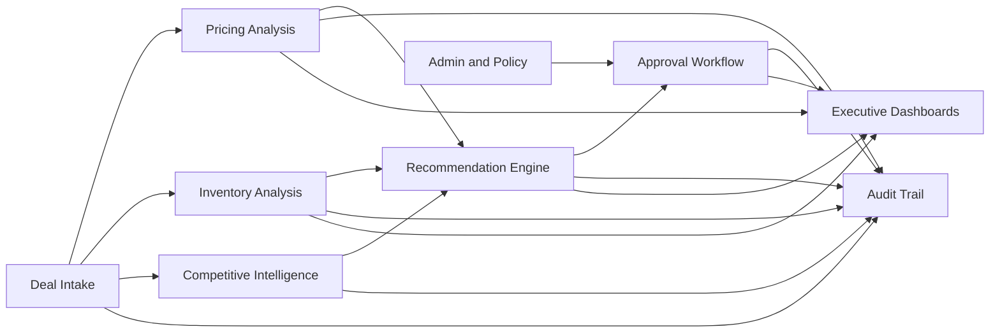

# Modules

## Overview

Commercial Deal Desk Copilot should be organized into modules that map to product capabilities. The MVP can implement these modules inside one application while keeping responsibilities distinct.

## Module Map

## Deal Intake Module

### Purpose

Capture proposed commercial deals and prepare them for analysis and approval.

### Users

- Sales representatives
- Sales managers
- Administrators

### Responsibilities

- Create deal requests.
- Save drafts.
- Edit deal details before submission.
- Capture customer, opportunity, product, pricing, quantity, delivery, and term data.
- Calculate deal totals.
- Validate required fields.
- Submit deals for analysis and approval.

### Key Screens

- Deal list.
- Deal creation form.
- Deal line item editor.
- Deal detail page.

### Inputs

- Customer data.
- Opportunity data.
- Product catalog.
- Price book data.
- User-entered commercial rationale.

### Outputs

- Deal record.
- Deal line items.
- Submission event.
- Initial audit events.

### MVP Requirements

- Manual deal entry.
- Product and customer selection from demo dataset.
- Draft and submit statuses.
- Basic validation.
- Totals and discount calculations.

### Future Enhancements

- CRM import.
- CPQ quote import.
- Attachment support.
- Deal cloning.
- Bulk line item upload.

## Pricing Analysis Module

### Purpose

Assess pricing quality, margin impact, and policy exceptions.

### Users

- Pricing analysts
- Sales managers
- Finance approvers
- Executives

### Responsibilities

- Calculate discount, revenue, cost, and margin.
- Compare against price book and floor price.
- Identify policy exceptions.
- Compare against historical approved and rejected deals.
- Produce pricing risk rating and summary.

### Inputs

- Deal line items.
- Product standard costs.
- Price book entries.
- Approval policies.
- Historical deal records.

### Outputs

- Pricing analysis record.
- Pricing exception flags.
- Historical comparable summary.
- Pricing risk rating.
- Audit event.

### MVP Requirements

- Discount and margin calculations.
- Rule-based pricing risk.
- Historical comparable count from demo data.
- Summary displayed on deal detail page.

### Future Enhancements

- Elasticity analysis.
- Segment-specific pricing benchmarks.
- Deal similarity search.
- Price optimization.
- Multi-currency pricing.

## Inventory Analysis Module

### Purpose

Assess whether the proposed deal can be fulfilled based on stock, supply, and allocation constraints.

### Users

- Operations reviewers
- Sales users
- Finance approvers
- Executives

### Responsibilities

- Check available quantity by product and region.
- Consider reserved inventory and forecast supply.
- Evaluate delivery date feasibility.
- Flag shortages and allocation restrictions.
- Produce inventory risk rating and summary.

### Inputs

- Deal line items.
- Inventory positions.
- Product lead times.
- Requested delivery dates.
- Allocation rules.

### Outputs

- Inventory analysis record.
- Product-level inventory flags.
- Deal-level inventory risk rating.
- Earliest feasible fulfillment date.
- Audit event.

### MVP Requirements

- Compare requested quantity to available quantity.
- Flag shortage and allocation risk.
- Display line-level inventory status.
- Produce deal-level inventory risk.

### Future Enhancements

- Live inventory integration.
- Supply forecast simulation.
- Regional substitution suggestions.
- Partial fulfillment recommendations.
- Manufacturing or procurement lead-time modeling.

## Competitive Intelligence Module

### Purpose

Provide relevant competitive context to support deal decisions.

### Users

- Sales users
- Sales managers
- Pricing analysts
- Executives

### Responsibilities

- Retrieve competitor records for account, product, region, and opportunity.
- Summarize known competitor pressure.
- Identify prior wins and losses.
- Separate sourced facts from inferred insights.
- Provide confidence and freshness indicators.

### Inputs

- Competitive intelligence records.
- Win/loss records.
- CRM notes in future phases.
- Market intelligence feeds in future phases.

### Outputs

- Competitive summary.
- Competitive pressure rating.
- Source references.
- Audit event.

### MVP Requirements

- Use seeded competitive intelligence records.
- Generate concise summary.
- Display competitor names, pressure rating, and source references.

### Future Enhancements

- Automated ingestion from CRM notes.
- Market intelligence provider integration.
- Competitor battlecards.
- Natural language search across sales notes.

## Recommendation Engine Module

### Purpose

Synthesize structured analysis and business rules into an explainable recommended action.

### Users

- Approvers
- Sales managers
- Pricing analysts
- Executives

### Responsibilities

- Combine pricing, inventory, competitive, and policy outputs.
- Recommend action.
- Provide confidence, rationale, risk drivers, and suggested conditions.
- Identify required approver roles.
- Capture model metadata and source references.
- Support user overrides and feedback.

### Inputs

- Pricing analysis.
- Inventory analysis.
- Competitive summary.
- Approval policy results.
- Historical deal context.

### Outputs

- Recommendation record.
- Recommended action.
- Rationale.
- Conditions.
- Risk flags.
- Required approval roles.
- Audit event.

### MVP Requirements

- Structured recommendation output.
- Explainable rationale.
- Confidence rating.
- Required approver role list.
- Stored model metadata.

### Future Enhancements

- Feedback loop from approval outcomes.
- Recommendation performance dashboard.
- Advanced deal similarity.
- Configurable recommendation strategy.

## Approval Workflow Module

### Purpose

Route deals to the right reviewers and capture final decisions.

### Users

- Sales managers
- Pricing analysts
- Finance approvers
- Operations reviewers
- Legal reviewers
- Executives

### Responsibilities

- Evaluate approval policies.
- Create approval steps.
- Assign users or roles.
- Track workflow status.
- Capture decisions and comments.
- Support escalation and requested changes.
- Notify users of required actions.

### Inputs

- Deal data.
- Approval policies.
- Recommendation output.
- User roles and scopes.

### Outputs

- Approval plan.
- Approval steps.
- Status changes.
- Decision records.
- Audit events.

### MVP Requirements

- Role-based approval routing.
- Approver queue.
- Approve, reject, request changes, and escalate.
- Sequential approval flow.
- Comments.

### Future Enhancements

- Parallel approvals.
- Delegation.
- SLA timers.
- Escalation notifications.
- Approval policy builder.

## Audit Trail Module

### Purpose

Provide a reliable, immutable record of deal lifecycle activity.

### Users

- Approvers
- Administrators
- Compliance users
- Executives

### Responsibilities

- Record user and system actions.
- Record AI outputs and metadata.
- Record before and after values where relevant.
- Display audit timeline on deal detail page.
- Support audit export in future phases.

### Inputs

- User actions.
- System actions.
- Analysis outputs.
- Recommendation outputs.
- Workflow decisions.

### Outputs

- Audit event records.
- Deal audit timeline.

### MVP Requirements

- Audit event creation for core deal lifecycle.
- Deal-level audit timeline.
- AI recommendation metadata captured.

### Future Enhancements

- Exportable audit reports.
- Sensitive data access logging.
- Tamper-evident audit storage.
- Retention policy controls.

## Executive Dashboard Module

### Purpose

Provide leadership visibility into deal pipeline, risk, discounting, cycle time, and bottlenecks.

### Users

- Executives
- Sales leaders
- Finance leaders
- Operations leaders

### Responsibilities

- Aggregate deal metrics.
- Display portfolio trends.
- Highlight risk and exceptions.
- Support filtering and drill-down.
- Show approval bottlenecks.

### Inputs

- Deals.
- Approval steps.
- Pricing analyses.
- Inventory analyses.
- Recommendations.
- Audit events.

### Outputs

- Pipeline summary.
- Cycle time metrics.
- Margin and discount exposure.
- Risk summaries.
- Bottleneck view.

### MVP Requirements

- Deals by status.
- Deals by risk level.
- Average approval cycle time.
- Discount and margin exposure.
- Inventory risk summary.
- High-risk deal list.

### Future Enhancements

- Forecast impact.
- Trend analysis over quarters.
- Recommendation performance.
- Export to BI tools.
- Executive summary generation.

## Admin and Policy Module

### Purpose

Manage users, roles, demo configuration, and approval policies.

### Users

- Administrators
- Business operations users

### Responsibilities

- Manage users and roles.
- Manage approval policy records.
- Manage demo data loading.
- Configure thresholds.
- View system status.

### MVP Requirements

- Seeded users and roles.
- Seeded approval policies.
- Simple policy configuration through data records.

### Future Enhancements

- No-code policy builder.
- Role assignment UI.
- Integration configuration UI.
- Model configuration UI.

